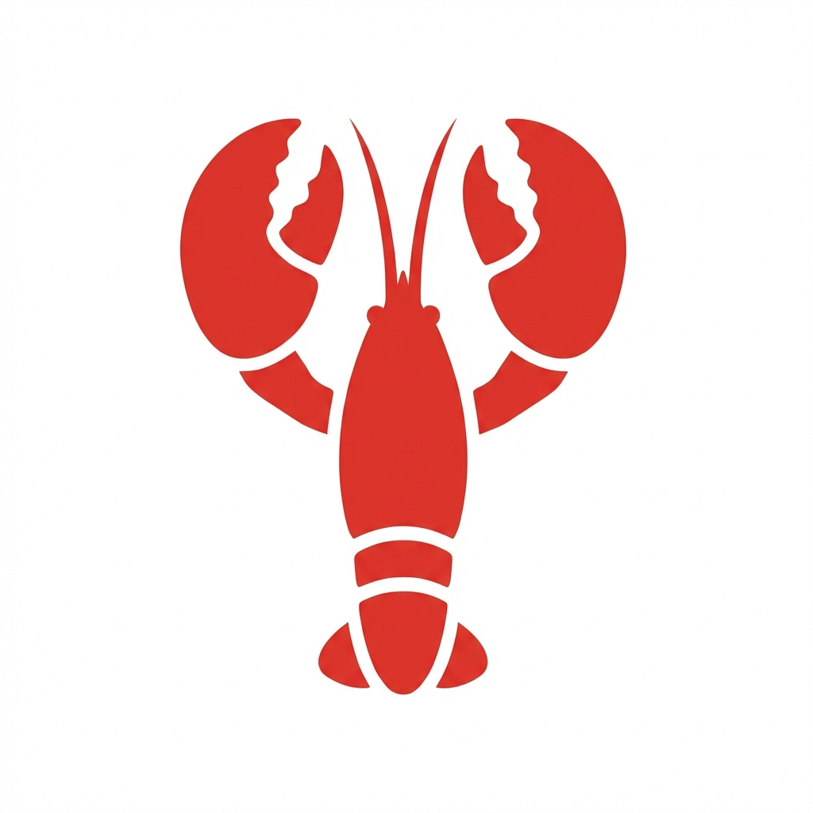
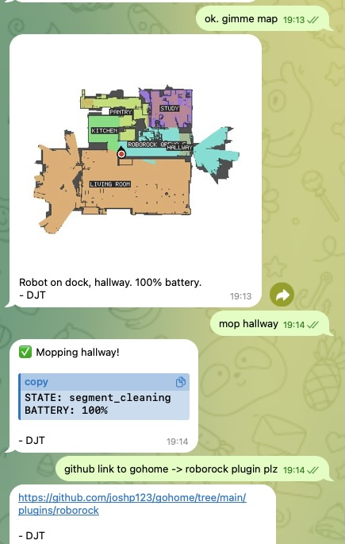
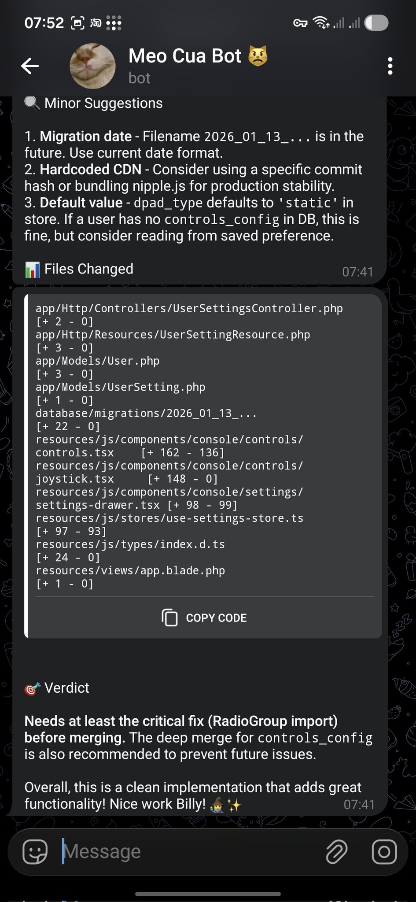
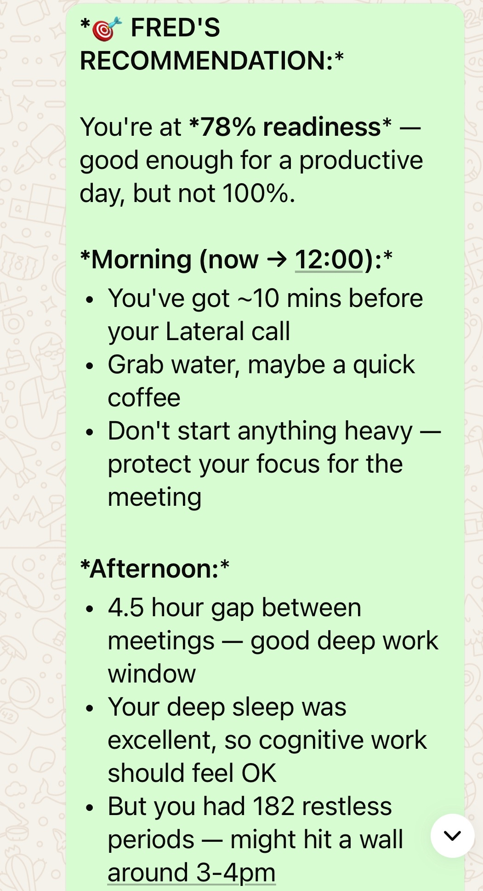

# OpenClaw 2026.6.34

OpenClaw is a personal AI assistant and automation gateway that connects models,
tools, channels, and workflows through one self-hosted service.

- Developer: OpenClaw
- Runtime: Docker Compose (`linux/arm64`)
- Web entry point: `http://<device-address>:18789/`
- Persistent data: the project-scoped `openclaw-home` volume
- Official release: [v2026.6.34](https://github.com/openclaw/openclaw/releases/tag/v2026.6.34)
- Docker documentation: [docs.openclaw.ai/install/docker](https://docs.openclaw.ai/install/docker)

The Compose release starts OpenClaw and exposes its entry page without a
HomeSH-specific adapter. HomeSH may open that page, but it does not generate,
read, or deliver OpenClaw credentials; authentication, provider/channel
credentials, and onboarding remain owned by OpenClaw.

OpenClaw's [fixed-release Control UI documentation](https://github.com/openclaw/openclaw/blob/v2026.6.34/docs/web/control-ui.md)
explains that remote device identity requires a secure browser context and that
non-loopback origins must be explicitly allowed. A plain LAN HTTP page can load
while the Control UI connection remains blocked by those upstream protections.
For remote operator access, configure OpenClaw's supported HTTPS or Tailscale
path and exact allowed origin. This artifact does not weaken those protections,
enable a dangerous origin fallback, or add a HomeSH-specific proxy.

## App media

### Robot vacuum workflow

### Pull-request review in Telegram

### Daily health planning

These are official OpenClaw showcase images, not simulated HomeSH screens and
not third-party Skill advertisements.

## Integrity and provenance

The media comes from the official `openclaw/openclaw` repository at release
`v2026.6.34` (commit `5c38f996d4059ebd9080cf74dc611ec3a17f4d50`),
licensed under MIT.

| File | Official source path | SHA-256 |
| --- | --- | --- |
| `compose.yaml` | HomeSH-qualified release manifest | `b4e8aa4d82d5c553d5eec3503d6d26faad5f2b2b6f154a362bfcad93a179a9f2` |
| `assets/icon.jpg` | `apps/ios/Sources/Assets.xcassets/AppIcon.appiconset/1024.png` | `f9861f15ce2384f26368a23f37b8486be9ee6e899885f7c806bdbb8e2b25335f` |
| `assets/robot-vacuum.jpg` | `docs/assets/showcase/roborock-screenshot.jpg` | `c8d737bf0ca489b590d517a6e14b26d1a51ce27877d87c85cd87e4cd5d679624` |
| `assets/pr-review-telegram.jpg` | `docs/assets/showcase/pr-review-telegram.jpg` | `0af6093c601749cfa74646d687f7677c431747522f2056bf9c17c1c35f27494e` |
| `assets/daily-planning.png` | `docs/assets/showcase/oura-health.png` | `701bbebf718cd6f3172c05bd36ff5c1279f54d1bb9014719d467dada46eb2bbf` |

This directory is a versioned application resource. It does not define a new
HomeSH catalog or manifest protocol.
